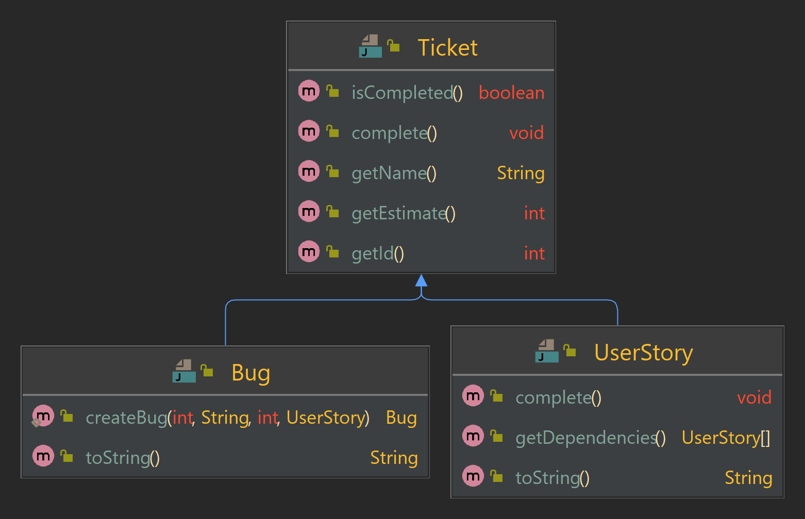

# Session 4 - Objects, Classes and OOP

---

## Agenda

* Introduction
* Objects and Classes
* Examples
* Proposed Problems

---

## Introduction


---

## Objects and Classes

* Two terms define an object:
  * attributes, 
  * and behavior
* An object is an entity that contains both data and behavior.
* In an object, methods are used to perform operations on the data as well as other actions.
* You can control the access to members of an object (both attributes and methods).
* **Data Hiding**: restricting access to specific attributes and/or methods is called *data hiding*

----
## Objects and Classes (2)

> **Recomendation**: "it is normally better to build small objects with specific tasks than building larger objects that perform many"
---

## Objects and Classes (3)

* What is exactly an object?

  > A program that uses OO technology is basically a collection of objects.

* Object data

  > The data stored within an object represent the state of the object (attributes).

* Object behaviors

  > The *behavior* of an object is what the object can do. The behaviors are contained in *methods*, and you invoke a method by sending a message to it.

---

## Object and Classes (4)

### Getter and Setters

> The concept of getters and setters supports the idea of data hiding.
>
> Getters and Setters are sometimes called accessor methods and mutator methods.

---

## Object and Classes (5)

### What is a class?

> A class is a blueprint for an object.
>
> An object cannot be instantiated without a class.
>
> Classes can be thought of as templates.
>
> A class can be thought of as a sort of higher-level data type.

---

## Object and Classes (6)

### Encapsulation and Data Hiding


---

## Examples

---

### Example 1. Remove Duplicates

#### Definition

Assuming a sorted array of positive numbers

```java
int[] sortedNumbers = { 1, 2, 2, 3, 3, 4, 4, 4};
```

removing the duplicates should give the following result:

```plaintext
[ 1, 2, 3, 4]
```

> Job Interview Tips: Problem-solving strategies
>
> It would help if you asked a few questions to clarify the context and gain a better understanding.
>
> 1. Is it necessary to keep the order/sorting of the numbers?
> 2. May a new array be created, or must the actions be performed in place—within the original array?
> 3. For in place, there are further questions:
>    1. What exactly should happen when removing/deleting?
>    2. What values represent no entry?

---

### Example 1. Solution

```java
public void removeDuplicates(int[] array) {
   
}
public int[] removeDuplicates2(int[] array) {
    
}
```

---

### Example 2. Even Before Odd Numbers

#### Description 

Write the method void orderEventBeforeOdd(int[]). This method is supposed to rearrange an array of `int` values so that the even numbers appear first, followed by the odd numbers. The order within the even and odd numbers is not relevant.

#### Examples

| Input                    | Output                   |
| ------------------------ | ------------------------ |
| `[1,2,3,4,5,6,7,8,9,10]` | `[2,4,6,8,10,3,7,1,9,5]` |
| `[2,4,6,1,8]`            | `[2,4,6,8,1]`            |
| `[2,4,6,8,1]`            | `[2,4,6,8,1]`            |

---

### Example 2. Solution

```java
void orderEventBeforedOdd(int[] ary) {
    
}
```


---

## Proposed Problems

---

### Proposed Problems - [Line-intersection](https://gitlab.com/juan_cardona_epam/line-intersection)

The purpose of this exercise is to train you to work with classes and methods.

Estimated workload of this exercise is *45 min*.

#### Description

Please, implement the method `intersection(Line)` in class [`Line`](). It  must return a [`Point`]() of intersection of two lines.

Note that lines are defined by linear equations: `y = k * x + b`. Line constructor takes `k` and `b` coefficients as parameters.

If lines coincide or do not intersect, the method must return null. It may seem surprising that we use `int` for arguments and fields of coordinates. The point is that using `double` will bring some extra complexity we want to avoid for this basic exercise. All tests are selected in to induce calculations without remainders.

You may check your result in class [`Main`]().

### Example

```java
public class Main {
    public static void main(String[] args) {
        Line line1 = new Line(1,1);
        Line line2 = new Line(-1,3);

        System.out.println(line1.intersection(line2)); // (1;2)
    }
}
```

---

### Proposed Problems - [Decrementing carousel](https://gitlab.com/juan_cardona_epam/decrementing-carousel)

The purpose of this exercise is to train you designing simple classes and their relations.

Estimated workload of this exercise is *2h*.

#### Description

[`Decrementing Carousel`]() is a container, accepting `int` elements. `DecrementingCarousel` has a maximum capacity, specified via the constructor. When created, `DecrementingCarousel` is in accumulating state: you may add elements via the `addElement` method and can produce a [`CarouselRun`]() object via the `run` method. Once the `run` method is called, `DecrementingCarousel` is in running state: it refuses adding more elements.

The `CarouselRun` allows to iterate over elements of the carousel decrementing them one by one with the `next` method. The `next` returns the value of the current element:

[]()

Then it decreases the current element by one and switches to the next element:

[]() []()

The `CarouselRun` iterates over elements in the order of their insertion.
 When an element is decreased to zero, the `CarouselRun` will skip it in further iterations. When there are no more elements available for decrementing, the `CarouselRun` returns `-1`.

The `CarouselRun` also has the `isFinished` method, which indicates, if the carousel has run out of the lements to decrement.

#### Specification Details

`DecrementingCarousel` has two public methods:

- `boolean addElement(int element)` - adds an element. If element is negative or zero, do not add the element. If container is full, do not add the element. If the `run` method was called to create a `CarouselRun`, do not add the element. If element is added successfully, return `true`. Return `false` otherwise.
- `CarouselRun run()` - returns a `CarouselRun` to iterate over the elements. If the `run` method has already been called earlier, it must return `null`: `DecrementingCarousel` may generate only one `CarouselRun` object.

`CarouselRun` has two public methods:

- `int next()` - returns the current value of the current element, then decreases the current element by one and switches to the next element in insertion order. Skips zero elements. When there is no more elements to decrease, returns `-1`.
- `boolean isFinished()` - when there is no more elements to decrease, returns `true`. Otherwise, returns `false`.

#### Examples

Empty case:

```java
CarouselRun run = new DecrementingCarousel(7).run();
System.out.println(run.isFinished()); //true
System.out.println(run.next()); //-1
```

Regular case:

```java
DecrementingCarousel carousel = new DecrementingCarousel(7);

carousel.addElement(2);
carousel.addElement(3);
carousel.addElement(1);

CarouselRun run = carousel.run();

System.out.println(run.isFinished()); //false

System.out.println(run.next()); //2
System.out.println(run.next()); //3
System.out.println(run.next()); //1

System.out.println(run.next()); //1
System.out.println(run.next()); //2

System.out.println(run.next()); //1

System.out.println(run.isFinished()); //true
System.out.println(run.next()); //-1
```

Refusing adding more elements case:

```java
DecrementingCarousel carousel = new DecrementingCarousel(3);

System.out.println(carousel.addElement(-2)); //false
System.out.println(carousel.addElement(0)); //false
        
System.out.println(carousel.addElement(2)); //true
System.out.println(carousel.addElement(3)); //true
System.out.println(carousel.addElement(1)); //true

//carousel is full
System.out.println(carousel.addElement(2)); //false

CarouselRun run = carousel.run();

System.out.println(run.next()); //2
System.out.println(run.next()); //3
System.out.println(run.next()); //1

System.out.println(run.next()); //1
System.out.println(run.next()); //2

System.out.println(run.next()); //1

System.out.println(run.isFinished()); //true
System.out.println(run.next()); //-1
```

Refusing to add more elements after "run" was called:

```java
DecrementingCarousel carousel = new DecrementingCarousel(10);

System.out.println(carousel.addElement(2)); //true
System.out.println(carousel.addElement(3)); //true
System.out.println(carousel.addElement(1)); //true

carousel.run();

System.out.println(carousel.addElement(2)); //false
System.out.println(carousel.addElement(3)); //false
System.out.println(carousel.addElement(1)); //false
```

Refusing to create more than one CarouselRun:

```java
DecrementingCarousel carousel = new DecrementingCarousel(10);
System.out.println(carousel.run() == null); //false
System.out.println(carousel.run() == null); //true
```

---

### Proposed Problems - [Halving Carousel](https://gitlab.com/juan_cardona_epam/halving-carousel)

The purpose of this exercise is to train you to use extend classes with `extends` keyword.

Estimated workload of this exercise is *30 min*.

Note, that if you have not done the "Decrementing Carousel" exercise, you have to implement `DecrementingCarousel` and `CarouselRun` classes. Details are specified in [DC.md]().

#### Description

In this exercise you need to extend [`DecrementingCarousel`](). You need to implement [`HalvingCarousel`](). This subclass must halve elements instead of decrementing it by one. Note that you need to apply regular integer division, discarding the remainder. For example, `5 / 2 = 2`.

#### Examples

Empty case:

```java
CarouselRun run = new HalvingCarousel(7).run();
System.out.println(run.isFinished()); //true
System.out.println(run.next()); //-1
```

Regular case:

```java
DecrementingCarousel carousel = new HalvingCarousel(7);

carousel.addElement(20);
carousel.addElement(30);
carousel.addElement(10);

CarouselRun run = carousel.run();

System.out.println(run.isFinished()); //false

System.out.println(run.next()); //20
System.out.println(run.next()); //30
System.out.println(run.next()); //10

System.out.println(run.next()); //10
System.out.println(run.next()); //15
System.out.println(run.next()); //5

System.out.println(run.next()); //5
System.out.println(run.next()); //7
System.out.println(run.next()); //2

System.out.println(run.next()); //2
System.out.println(run.next()); //3
System.out.println(run.next()); //1

System.out.println(run.next()); //1
System.out.println(run.next()); //1

System.out.println(run.isFinished()); //true
System.out.println(run.next()); //-1
```

---

### Proposed Problems - [Gradually Decreasing Carousel](https://gitlab.com/juan_cardona_epam/gradually-decreasing-carousel)

The purpose of this exercise is to train you to use extend classes with `extends` keyword.

Estimated workload of this exercise is *30 min*.

Note, that if you have not done the "Decrementing Carousel" exercise, you have to implement `DecrementingCarousel` and `CarouselRun` classes. Details are specified in [DC.md]().

#### Description

In this exercise you need to extend [`DecrementingCarousel`](). You need to implement [`GraduallyDecreasingCarousel`](). This subclass must decrement elements by gradually increasing decrement. When you need to decrement an element for the first time, decrease it by `1`. Next time you need to decrement the same element, decrease it by `2`. Next time decrease by `3`, then by `4` and so on. Remember that you must not make process non-positive elements.

#### Examples

Empty case:

```java
CarouselRun run = new GraduallyDecreasingCarousel(7).run();
System.out.println(run.isFinished()); //true
System.out.println(run.next()); //-1
```

Regular case:

```java
DecrementingCarousel carousel = new GraduallyDecreasingCarousel(7);

carousel.addElement(20);
carousel.addElement(30);
carousel.addElement(10);

CarouselRun run = carousel.run();

System.out.println(run.isFinished()); //false

System.out.println(run.next()); //20
System.out.println(run.next()); //30
System.out.println(run.next()); //10

System.out.println(run.next()); //19
System.out.println(run.next()); //29
System.out.println(run.next()); //9

System.out.println(run.next()); //17
System.out.println(run.next()); //27
System.out.println(run.next()); //7

System.out.println(run.next()); //14
System.out.println(run.next()); //24
System.out.println(run.next()); //4

System.out.println(run.next()); //10
System.out.println(run.next()); //20

System.out.println(run.next()); //5
System.out.println(run.next()); //15

System.out.println(run.next()); //9

System.out.println(run.next()); //2

System.out.println(run.isFinished()); //true
System.out.println(run.next()); //-1
```

---

### Proposed Problems - [Sprint Planning](https://gitlab.com/juan_cardona_epam/sprint-planning)

The purpose of this exercise is to train basic inheritance features.

The estimated workload of this exercise is *120 min*.

#### Description

In this exercise we are going to manage business logic of planning a sprint. A sprint is the basic unit of software development in SCRUM. Sprints are timeboxed. Time capacity of a sprint is agreed while planning. Then we consdier a sprint to be filled with some tasks.

We consider a task to be implemented with general-purpose `Ticket` class. But we also consider a sprint to accept only subtypes of the `Ticket` class: `Bug` and `UserStory`.

Here is a diagram depicting the public interface of these classes and their relations:

[]()

Here are API details:

- Ticket

  Every ticket has an id, a name and an estimate of hours to complete it. One provides them via the constructor of the 

  ```
  Ticket
  ```

   class. Also, a ticket may be completed or not. When a ticket is created, it is not completed.

  - `getId()` - Returns the id of the ticket.
  - `getName()`  - Returns the name of the ticket.
  - `getEstimate()` - Returns the estimate of the ticket.
  - `isCompleted()` - Returns `true` if the ticket is completed, `false` otherwise.
  - `complete()` - Sets the ticket to completed state.

- UserStory

  We consider a user story to be a ticket that may contain some dependencies. A dependency is another user story that must be completed first to allow the dependent user story to complete. One provides dependencies of the UserStory via the constructor of the 

  ```
  UserStory
  ```

   class.

  - `complete()` - Like the `Ticket#complete()` method, this sets the ticket to completed state. The difference is that the user story may not be completed if its dependencies are not completed yet.
  - `getDependencies()` - Returns a defensive copy of dependencies array.
  - `toString()` - Returns a String representing this user story, using its id and name. Example: "[US 1] User Registration Entity"

- Bug

  We consider a bug to be a ticket, that is related to some completed user story. Bugs may not exists by their on, without a related user story.

  - `createBug(int id, String name, int estimate, UserStory userStory)` - A static method to create a Bug instance.
     Returns `null` if the related user story is `null` or is not completed. Otherwise, returns a created Bug instance.
  - `toString()` - Returns a String representing this bug, using its id, name and the name of the related user story.
     Example: with id = 2, name = "Add password repeat" and the related user story name = "Registration Form" the resulting string would be "[Bug 2] Registration Form: Add password repeat"

- Sprint

  Sprints has the time capacity and the tickets limit, specified via constructor. It is not allowed for a Sprint to contain tickets with total estimate greater than time capacity. It is not allowed for a Sprint to contain total amount of tickets greater than tickets limit.

  We consider a sprint to accept tickets via 

  ```
  add*
  ```

   methods. That methods return 

  ```
  true
  ```

   when an input ticket was accepted and 

  ```
  false
  ```

   otherwise. Note that we consider a sprint to not accept:

  1. `null` values,
  2. tickets, that are already completed
  3. tickets, that has an estimate value that will lead to capacity overflow if added
  4. any ticket, if the sprint ticket limit is reached.

  - `addUserStory(UserStory userStory)` - accepts a userStory, if it is not `null`, not completed and its uncompleted dependencies are already accepted to the sprint. Returns `true` if the user story is accepted, `false` otherwise.
  - `addBug(Bug bugReport)` - accepts a bug, if it is not `null` and not completed. Returns `true` if the bug is accepted, `false` otherwise.
  - `getTickets()` - Returns a defensive copy of the array of the sprint tickets. Make sure the order of tickets is as they were accepted to the sprint.
  - `getTotalEstimate()` - Returns the sum of estimates of all the tickets accepted to the sprint.

**Important restriction:** Note that in this exercise you **may not** use *Collections* and *Streams*.

#### Examples

See usage examples in tests inside [src/test/java]().

#### References

Wikipedia on the Scrum Sprint: https://en.wikipedia.org/wiki/Scrum_(software_development)#Sprint


# Session 5 - Abstract Classes and Interfaces

---

## Agenda

* Introduction
* Abstract Classes
* Abstract Subclasses
* Interfaces
* Abstract Classes or Interfaces?
* Examples
* Proposed Problems

---

## Introduction


---

## Abstract Classes

* The definition of an **abstract method** comprises a method header, without a method body existing.
* An **abstract class** is a class that is not intended to be instantiated.
* An **abstract class** is intended to serve as a superclass for other classes.
* **Abstract classes** can contain abstract methods.

----

## Abstract Subclasses

> For an abstract subclass to become concrete, it must provide implementations for all inherited abstract methods.
> Otherwise, the subclass itself will also be abstract.

---

## Interfaces

> An **interface** in Java is a specification of a type (in the form of a type name or a set of methods) that does not define any implementation for the methods.

---

## Interfaces (2)

* Interfaces as Types.
* Interfaces as Specification.

---

## Abstract Classes or Interfaces?

* Before Java 8, the issue seemed more straightforward: if a type needed concrete implementation elements, such as instance fields, constructors, or method bodies, an abstract class would have to be used.
* However, the current availability of default methods in the interface should not modify the answer in question.
* Generally, it is preferable not to define default methods in interfaces except to adapt old code.
* If we can choose the interfaces, they would be preferable.
* Interfaces are relatively lightweight types that minimize limitations on implementing classes.
* Interfaces allow multiple inheritance.
* Interfaces allow for a more flexible and expandable structure.


---

## Examples

---

### Example 1. Remove Duplicates

#### Definition

Assuming a sorted array of positive numbers

```java
int[] sortedNumbers = { 1, 2, 2, 3, 3, 4, 4, 4};
```

removing the duplicates should give the following result:

```plaintext
[ 1, 2, 3, 4]
```

> Job Interview Tips: Problem-solving strategies
>
> It would help if you asked a few questions to clarify the context and gain a better understanding.
>
> 1. Is it necessary to keep the order/sorting of the numbers?
> 2. May a new array be created, or must the actions be performed in place—within the original array?
> 3. For in place, there are further questions:
>    1. What exactly should happen when removing/deleting?
>    2. What values represent no entry?

---

### Example 1. Solution

```java
public void removeDuplicates(int[] array) {
   
}
public int[] removeDuplicates2(int[] array) {
    
}
```

---

### Example 2. Even Before Odd Numbers

#### Description 

Write the method void orderEventBeforeOdd(int[]). This method is supposed to rearrange an array of `int` values so that the even numbers appear first, followed by the odd numbers. The order within the even and odd numbers is not relevant.

#### Examples

| Input                    | Output                   |
| ------------------------ | ------------------------ |
| `[1,2,3,4,5,6,7,8,9,10]` | `[2,4,6,8,10,3,7,1,9,5]` |
| `[2,4,6,1,8]`            | `[2,4,6,8,1]`            |
| `[2,4,6,8,1]`            | `[2,4,6,8,1]`            |

---

### Example 2. Solution

```java
void orderEventBeforedOdd(int[] ary) {
    
}
```


---

## Proposed Problems

---

### Proposed Problems - [Task Carousel](https://gitlab.com/juan_cardona_epam/task-carousel)

The purpose of this exercise is to train you designing simple interface implementations and use them.

Estimated workload of this exercise is *2h*.

### Description

In this exercise you need to design two implementations of the [`Task`]() interface:

- `CountDownTask`:
  - The constructor of `CountDownTask` takes a single int value as a parameter. It is the initial value of the countdown. Input value must not be negative. If it is, set zero value.
  - Each time the `execute` method is called, this value decrements by one, until it reaches zero. Then the `execute` method no longer decrements the value and the task is considered finished.
  - If the task is initialized with zero value, consider it finished right upon creating.
  - Value of the task is accessible via getter.
- `CompleteByRequestTask`:
  - Constructor of the `CompleteByRequestTask` takes no parameters.
  - Calling `execute` method on the task does not make it finished until the `complete` method is called.
  - Once the `complete` method is called, the next call to `execute` makes the task finished. Note that the task is not finished right after calling the `complete` method. The task finishes **only** when subsequent call to `execute` occurs.

Also, you need to implement the [`TaskCarousel`]():

- A task carousel has a capacity provided as a constructor parameter.

- The `TaskCarousel` has `isEmpty` method. It returns `true` if there is no task in the carousel for execution. Returns `false` otherwise.

- The `TaskCarousel` has `isFull` method. It returns `true` if there is no more room in the carousel to add another task. Returns `false` otherwise.

- You may add tasks to the carousel via 

  ```
  addTask
  ```

   method. It returns 

  ```
  true
  ```

   if the task is accepted and 

  ```
  false
  ```

   otherwise. Task may be not accepted due to following reasons:

  - Task argument is null.
  - Task is already finished.
  - Carousel is full.

- You may execute tasks in the carousel via 

  ```
  execute
  ```

   method.

  - Each time when this method is invoked, carousel must switch to the next task within and execute it.
  - Iteration is in circular manner. If there are 4 tasks inside a carousel, then if we call `execute` method on the carousel 4 times in a row, each task must be executed once.
  - If the task is finished after execution, remove it from the carousel.
  - The method returns `true` if any task was executed. Returns `false` otherwise.

### Examples

Single task case:

```java
TaskCarousel carousel = new TaskCarousel(4);

System.out.println(carousel.isEmpty()); //true
System.out.println(carousel.isFull()); //false
System.out.println(carousel.execute()); //false

CountDownTask task = new CountDownTask(2);
System.out.println(carousel.addTask(task)); //true

System.out.println(carousel.isEmpty()); //false
System.out.println(carousel.isFull()); // false

System.out.println(task.getValue()); //2
System.out.println(carousel.execute()); //true
System.out.println(task.getValue()); //1
System.out.println(carousel.execute()); //true 
System.out.println(task.getValue()); //0

System.out.println(carousel.execute()); //false
System.out.println(carousel.isEmpty()); //true
```


Three tasks case:

```java
TaskCarousel carousel = new TaskCarousel(3);

CountDownTask task1 = new CountDownTask(2);
CountDownTask task2 = new CountDownTask(2);
CompleteByRequestTask task3 = new CompleteByRequestTask();

System.out.println(carousel.addTask(task1)); //true
System.out.println(carousel.addTask(task2)); //true
System.out.println(carousel.addTask(task3)); //true
        
System.out.println(carousel.isFull()); // true
        
for(int i = 0; i < 100; i++){
    System.out.println(carousel.execute()); // true
}

System.out.println(task1.isFinished()); // true
System.out.println(task2.isFinished()); // true
System.out.println(task3.isFinished()); // false

task3.complete();

System.out.println(task3.isFinished()); // false
System.out.println(carousel.execute()); // true
System.out.println(task3.isFinished()); // true

System.out.println(carousel.isEmpty()); // true
```

---

### Proposed Problems - [Figures](https://gitlab.com/juan_cardona_epam/figures)

The purpose of this exercise is to train you to work with classes, methods and inheritance.

Estimated workload of this exercise is *60 min*.

### Description

Please, make [`Triangle`](), [`Quadrilateral`](), [`Circle`]() classes extend [`Figure`]() abstract class.

Implement methods in `Triangle`, `Quadrilateral`, `Circle`:

1. constructors with following parameters:

   - `Triangle` - three vertices (points) as parameters.
   - `Quadrilateral` - four vertices (points) as parameters.
   - `Circle` - point of the center and `double` value of the radius.

   All the input datasets in tests are guaranteed to form a non-degenerative figures. For Quadrilaterals, it is guaranteed that all test datasets would form a convex quadrilaterals.

2. `public double area()`
    Return the area of the figure.
    *Note:* Convex quadrilaterals can be divided into two triangles by any of their diagonals.

3. `public String pointsToString()`
    Return a String value in following formats:

   - ```
     Triangle
     ```

      \-

     - Format: `(a.x,a.y)(b.x,b.y)(c.x,c.y)`
     - Example: `(0.0,0.0)(0.1,5.8)(7.0,7.0)`

   - ```
     Quadrilateral
     ```

      \-

     - Format: `(a.x,a.y)(b.x,b.y)(c.x,c.y)(d.x, d.y)`
     - Example: `(0.0,0.0)(0.0,7.1)(7.0,7.0)(7.0,0.0)`

   - ```
     Circle
     ```

      \-

     - Format: `(center.x,center.y)`
     - Example: `(0.0,0.6)`

   *Note:*: you may benefit from implementing toString() in the [`Point`]() class

4. `public String toString()`
    Return a String value in following formats:

   - ```
     Triangle
     ```

      \-

     - Format: `Triangle[(a.x,a.y)(b.x,b.y)(c.x,c.y)]`
     - Example: `Triangle[(0.0,0.0)(0.1,5.8)(7.0,7.0)]`

   - ```
     Quadrilateral
     ```

      \-

     - Format: `Quadrilateral[(a.x,a.y)(b.x,b.y)(c.x,c.y)(d.x, d.y)]`
     - Example: `Quadrilateral[(0.0,0.0)(0.0,7.1)(7.0,7.0)(7.0,0.0)]`

   - ```
     Circle
     ```

      \-

     - Format: `Circle[(center.x,center.y)radius]`
     - Example: `Circle[(0.0,0.6)4.5]`

   *Note*: you may use default implementation given in the `Figure` class, when it suits a case well.

5. `public Point leftmostPoint()`
    Return a leftmost point of the figure: the one having the least `X` coordinate.
    If there are many leftmost points, return any of them.

[`Point`]() class is already there.

Hints:

- [Degeneracy reference](https://en.wikipedia.org/wiki/Degeneracy_(mathematics))
- [Convex quadrilateral reference](https://en.wikipedia.org/wiki/Quadrilateral#Convex_quadrilaterals)
- [Triangle area reference](https://en.wikipedia.org/wiki/Triangle#Computing_the_area_of_a_triangle)
- [Circle area reference](https://en.wikipedia.org/wiki/Circle#Area_enclosed)
- [Quadrilateral area reference](https://en.wikipedia.org/wiki/Quadrilateral#Area_of_a_convex_quadrilateral)

## Examples

You may use [Main]() class to try your code. There are some examples below.

------

Sample code:

```java
...
double area = new Triangle(new Point(0,0), new Point(3, 0), new Point(0, 4)).area();
System.out.println(area);
```


Output:

```plaintext
6
```


------

Sample code:

```java
...
double area = new Quarilateral(new Point(1,0), new Point(2, 1), new Point(1, 2), new Point(0, 1)).area();
System.out.println(area);
```


Output:

```plaintext
2
```


------

Sample code:

```java
...
double area = new Circle(new Point(1,1), 3).area();
System.out.println(area);
```


Output:

```plaintext
28.274333882308138
```

---

### Proposed Problems - [Figures Extra](https://gitlab.com/juan_cardona_epam/figures-extra)

The purpose of this exercise is to train you to work with classes, methods and inheritance.

Estimated workload of this exercise is *60 min*.

### Description

Please, make [`Triangle`](), [`Quadrilateral`](), [`Circle`]() classes extend [`Figure`]() abstract class.

Implement methods in `Triangle`, `Quadrilateral`, `Circle`:

1. Constructors with following parameters:

   - `Triangle` - three vertices (points) as parameters.

   - `Quadrilateral` - four vertices (points) as parameters.

   - `Circle` - point of the center and double value of the radius.

     Ensure figures are not degenerative.
      All of them must have non-zero area.
      Quadrilateral is also must be convex.
      If a figure is not good, throw an IllegalArgumentException.
      *Note*: A non-degenerative convex quadrilateral is divided into four non-degenerative triangles by its diagonals. *Note*: double calculations are not completely accurate, use *error delta*, where applies.

2. `public Point centroid()`
    Return the centroid of the figure.
    Centroid refers to center of mass of the plain figure, not the baricenter.
    In other words it should be *"area centroid"*.

3. ```
   public boolean isTheSame(Figure figure)
   ```

   Two figures are considered to be the same only:

   - if they have the same type

   - and if they coincide (e.g. have same vertices).

     *Note*: order of the vertices have not to be the same.
      *Note*: double calculations are not completely accurate, use *error delta*, where applies.

*Note for curious: it is almost like `equals()` but it is not. Method `equals` requires consistent behavior alongside `hashCode()` and it is quite complicated to establish in terms of approximate equality like in this exercise*

[`Point`]() class is already there.

You may use `main` method of `Figure` class to tryout your code.

Hints:

- [Degeneracy reference](https://en.wikipedia.org/wiki/Degeneracy_(mathematics))
- [Convex quadrilateral reference](https://en.wikipedia.org/wiki/Quadrilateral#Convex_quadrilaterals)
- [Circle centroid reference](https://www.engineeringintro.com/mechanics-of-structures/centre-of-gravity/centroid-of-circle/)
- [Triangle centroid reference](https://en.wikipedia.org/wiki/Centroid#Of_a_triangle)
- [Quadrilateral centroid reference](https://en.wikipedia.org/wiki/Quadrilateral#Remarkable_points_and_lines_in_a_convex_quadrilateral)
- [Quadrilateral centroid reference 2](https://sites.math.washington.edu/~king/java/gsp/center-mass-quad.html)


