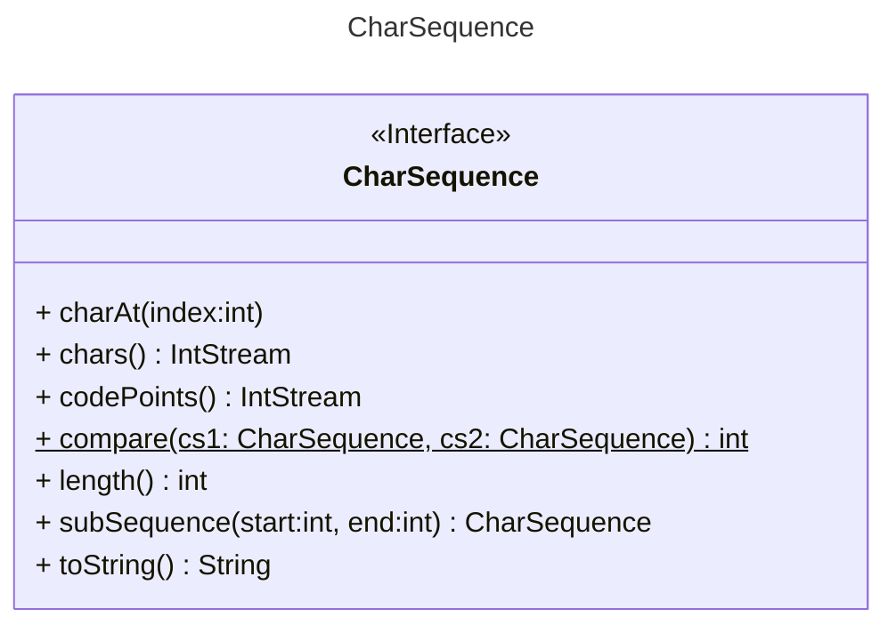
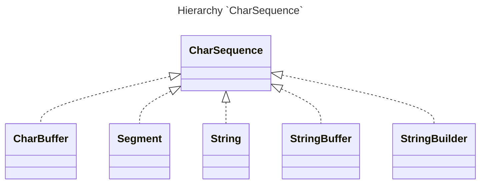
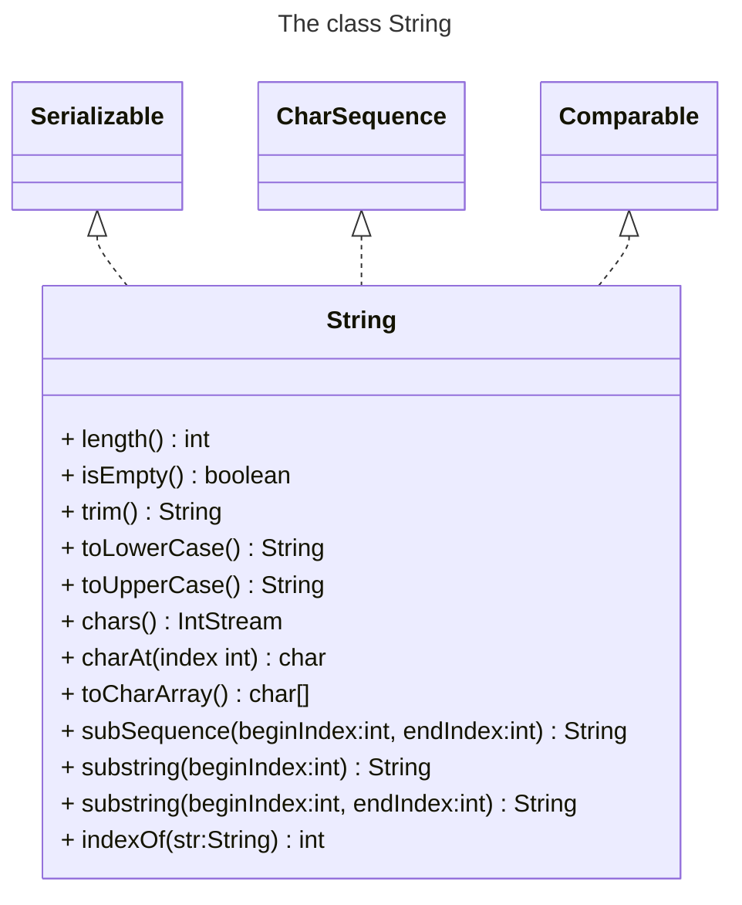
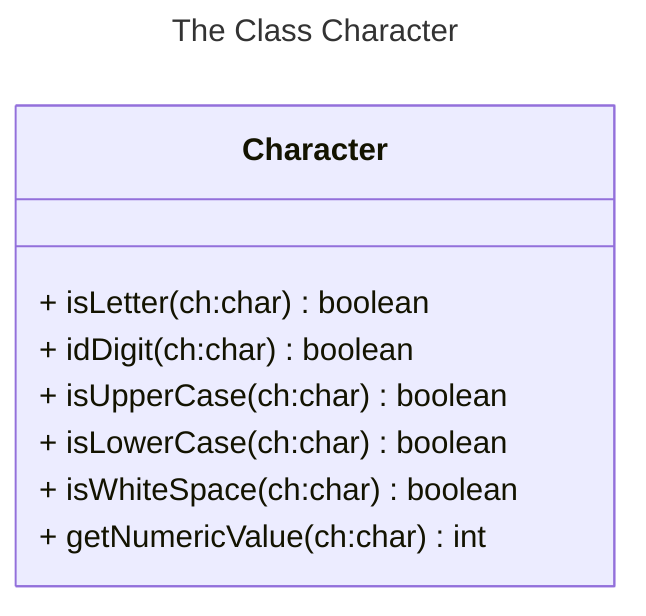
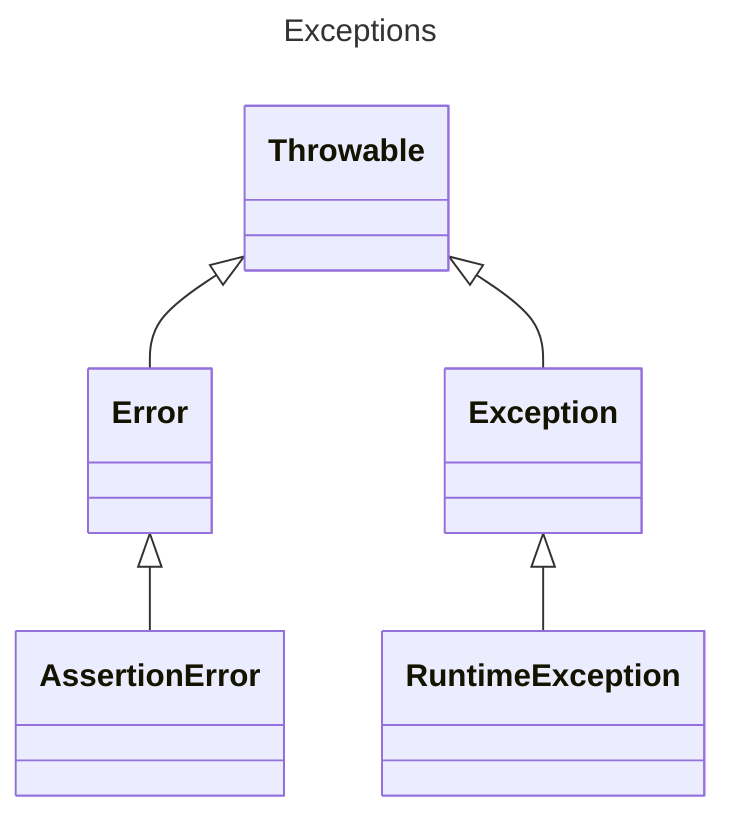

# Session 5 - Working with String, Errors, Exceptions, and Error Handling

---

## Agenda

* Introduction
* String
* Errors and Exceptions
* Error Handling
* Examples
* Proposed Problems

---

## Introduction

---

## Working with Strings

###  `CharSequence`

* Interface `CharSequence`
* The classes `StringBuffer` and `StringBuilder`
* The class `String`
* The class `Character`



---

## Working with String

### Hierarchy `CharSequence`



---

### The class `String`



### The classes `StringBuffer` and `StringBuilder`

| `String`                         | `StringBuffer`/`StringBuider` |
| -------------------------------- | ----------------------------- |
| `+`, `+=`, `concat()`            | `append()`                    |
| `replace()`, `substring()`       | `replace()`, `substring()`    |
| `indexOf()`, `startsWith()`      | `indexOf()`                   |
| `endWith()`                      | `lastIndexOf()`               |
| **no method available**          | `reverse()`                   |
| **no method available**          | `insert()`                    |
| **no method available**          | `delete()`                    |
| `toUpperCase()`, `toLowerCase()` | **no method available**       |

---

### The Class `Character`




----

## Error and Exceptions

> You will always encounter errors in the real world.
>
> How you handle them helps show the quality of your code.
>
> An *exception* indicates an unusual condition or an error condition. 
>
> Exceptions are represented by instances of the class `java.lang.Exception`




---

## Exception Handling

```java
try {
    readFromFile("foo");
} catch (Exception e) {
    System.out.println("Exception while reading file: " + e);
}
```


---

## Examples

---

### Example. Homemade Conversion with Character

#### Definition

Using the `Character` class, you can convert textual digits to their numeric values. For decimal digits

```java
int digitValue = digitAsChar - '0';
int posOfChar = currentChar - 'A';
```

> Converting hexadecimal numbers to decimal numbers.

```java
static int convertToDecimal(final String hexDigits) {
    // Implements
}
```


---

### Example. Solution. Homemade Conversion with Character

```java
static int convertToDecimal(final String hexDigits) {
    int value = 0;
    
    for (int i = 0; i < hexDigits.length(); i++) {
        final char currentChar = hexDigits.charAt(i);
        int digitValue = hexDigitToDecimal(currentChar);
        value = value * 16 + digitValue;
    }
    
    return value;
}

static int hexDigitToDecimal(final char currentChar) {
    if (Character.isDigit(currentChar)) {
        return currentChar - '0';
    }
    
    return currentChar - 'A' + 10;
}
```

---

### Example. Solution. Homemade Conversion with Character

```java
static int convertToDecimal(final String hexDigits) {
    int value = 0;
    
    for (int i = 0; i < hexDigits.length(); i++) {
        final char currentChar = hexDigits.charAt(i);
        int digitValue = Character.getNumericValue(currentChar);
        value = value * 16 + digitValue;
    }
    
    return value;
}
```

---

### Example. Solution. Homemade Conversion with Character

```java
static int hexDigitToDecimal(final char hexDigit) {
    final int position = "0123456789ABCDEF".indexOf(hexDigit);
   	if (position < 0) {
        throw new IllegalArgumentException("invalid char: " + hexDigit)
    }
    
    return position;
}
```

---

### Example. Well-Formed Braces

#### Definition

> Write a method `boolean checkBraces(String)` which checks whether the sequence of round braces passed as string contains matching (properly nested) pair of braces.

#### Examples

| Input          | Result  | Comment                                                      |
| -------------- | ------- | ------------------------------------------------------------ |
| `"(())"`       | `true`  |                                                              |
| `"()()"`       | `true`  |                                                              |
| `"(()))((())"` | `false` | Although the same amount of opening and closing braces, they're not correctly nested |
| `"((()"`       | `false` | No suitable bracing                                          |

---

### Example. Solution. Well-Formed Braces

```java
import static java.util.Arrays.fill;

public static boolean checkBraces(String braces) {
   char current[] = new char[braces.length()];
   int top = 0;

   fill(current, ' ');
   for (int i = 0; i < braces.length(); i++) {
      if (braces.charAt(i) == '(') {
         current[top++] = '(';
      }
      else { // I assumed that all character are only '(' and ')'
         if (top > 0) {
            current[top--] = ' ';
         }
         else {
            return false;
         }
      }
   }
   return top == 0;
}
```


---

### Example. An exception example

#### Definition

Implements the Euclid Algorithm reading two values from the command line, if any argument is not valid the default values must be used: `2701` and `222`.

---

### Example. Solution an exception example

```java
public class Euclid {

   public static void main(String[] args) {
      int a = 2701;
      int b = 222;

      if (args.length == 2) {
         try {
            a = Integer.parseInt(args[0]);
            b = Integer.parseInt(args[1]);
         }
         catch (NumberFormatException nfe) {
            System.err.println("Arguments were not both numbers.");
            System.err.println("Using defaults.");
         }
      }
      else {
         System.err.print("Wrong numbers of arguments");
         System.err.println(" expected 2.");
         System.err.println("Using default.");
      }

      System.out.printf("The GCD of %d and %d is ", a, b);
      while (b != 0) {
         if (a > b) {
            a = a - b;
         }
         else {
            b = b - a;
         }
      }
      System.out.printf("%d%n", a);
   }
}
```

---

## Proposed Problems

---

### Proposed Problems - [Words](https://gitlab.com/juan_cardona_epam/words)

The purpose of this exercise is to train you to work with strings.

Estimated workload of this exercise is *60 min*.

#### Description

Please, implement [`StringUtil`]() class methods:

##### `countEqualIgnoreCaseAndSpaces`

Method signature:

```java
public static int countEqualIgnoreCaseAndSpaces(String[] words, String sample)
```

Return the number of words from `words` array that are equal to `sample` ignoring characters case and leading and trailing spaces.
 If `sample` is `null` or `words` is `null` or empty, return `0`. `words` is guaranteed to not contain `null` values.

##### `splitWords`

Method signature:

```java
public static String[] splitWords(String text)
```

Split `text` string into array of words using following separating characters: `",", ".", ";", ":", " ", "?", "!"`.
 For empty string, `null` string, and string consisting only of separating characters return `null`

##### `convertPath`

Method signature:

```java
public static String convertPath(String path, boolean toWin)
```

Convert `path` to Unix\Windows path depending on a `boolean` parameter.

Unix path may start with `~` or `/`. Every subdirectory must end with `/` character except the last one. Path elements `.` and `..` refer to current directory and parent directory. Filename doesn't necessarily have the extension.
 Unix path examples:

- `/folder/../folder/file.txt`
- `/dev/null`
- `file.txt`
- `folder/logs/`
- `~/user/some_logs`

Windows path may start with `C:`. Every subdirectory must end with `\ ` character except the last one. Path elements `.` and `..` refer to current directory and parent directory. Filename doesn't necessarily have the extension.
 Windows path examples:

- `file.txt`
- `\Program Files\some_file.exe`
- `.\to_do_list.txt`
- `C:\Users\..\Cygwin`
- `.\file`

Let's consider Unix `~` path to correspond to Windows `C:\User` path and vice versa.
 Let's consider Unix `/` root folder (i.e., when the path starts with `/`) to correspond to Windows `C:\ ` drive and vice versa (but `C:\User` still corresponds to `~`).

If `path` already corresponds to the required format (for instance, is Windows path when Windows paths is needed and `toWin` `boolean` parameter is `true`) return `path`.
 If `path` is `null`, empty, or doesn't correspond to any path format (Unix, Windows), return `null`.
 It is guaranteed that `path` is either a correct path, or it has some of the following errors:

- More than one `~`
- `~` is not at the start
- `~` mixed with `\ ` (`~` in Windows path)
- More than one `C:`
- `C:` is not at the start
- `C:` mixed with `/` (`C:` in Unix path)
- `\ ` mixed with `/`

Illegal paths example:

- `/folder1/folder2\folder3`
- `C:\User/root`
- `/dev/~/`
- `C:/a/b/c/d`
- `~\folder`
- `~/~`
- `~~`
- `C:\Folder\Subfolder\C:\ `

##### `joinWords`

Method signature:

```java
public static String joinWords(String[] words)
```

Join words from `words` array and return as a string in the following format: `"[str_1, str_2, ..., str_n]"`.

If `words` is `null` or empty return `null`. `words` is guaranteed to not contain `null` values. `words` may contain empty strings, ignore them, i. e. don't put them in the resulting string. If `words` contains only empty strings return `null`.

##### Hints

- While implementing the methods you might need to come up with `regular expressions`. You may consider using [regex101.com](https://regex101.com/) to easier design of regular expressions.
- You can and should use following methods\classes (click on the name):
  - [`String.strip`](https://docs.oracle.com/en/java/javase/11/docs/api/java.base/java/lang/String.html#strip())
  - [`String.split`](https://docs.oracle.com/en/java/javase/11/docs/api/java.base/java/lang/String.html#split(java.lang.String))
  - [`String.replaceAll`](https://docs.oracle.com/en/java/javase/11/docs/api/java.base/java/lang/String.html#replaceAll(java.lang.String,java.lang.String))
  - [`String.replaceFirst`](https://docs.oracle.com/en/java/javase/11/docs/api/java.base/java/lang/String.html#replaceFirst(java.lang.String,java.lang.String))
  - [`String.toLowerCase`](https://docs.oracle.com/en/java/javase/11/docs/api/java.base/java/lang/String.html#toLowerCase())
  - [`String.equalsIgnoreCase`](https://docs.oracle.com/en/java/javase/11/docs/api/java.base/java/lang/String.html#equalsIgnoreCase(java.lang.String))
  - [`String.startsWith`](https://docs.oracle.com/en/java/javase/11/docs/api/java.base/java/lang/String.html#startsWith(java.lang.String))
  - [`String.matches`](https://docs.oracle.com/en/java/javase/11/docs/api/java.base/java/lang/String.html#matches(java.lang.String))
  - [`String.join`](https://docs.oracle.com/en/java/javase/11/docs/api/java.base/java/lang/String.html#join(java.lang.CharSequence,java.lang.CharSequence...))
  - [`StringBuilder`](https://docs.oracle.com/en/java/javase/11/docs/api/java.base/java/lang/StringBuilder.html)
  - [`StringJoiner`](https://docs.oracle.com/en/java/javase/11/docs/api/java.base/java/util/StringJoiner.html)
  - [`StringTokenizer`](https://docs.oracle.com/en/java/javase/11/docs/api/java.base/java/util/StringTokenizer.html)

#### Examples

You may use `main` method of [`StringUtil`]() class to test your implementation.

```java
String[] words = new String[] {"   nice ", "nICE", "nic3"};
String sample = "NICE";
int result = StringUtil.countEqualIgnoreCaseAndSpaces(words, sample); // 2
words = new String[]{" zoOm ", " z oom", " Z O O M "};
sample = "ZOOM";
result = StringUtil.countEqualIgnoreCaseAndSpaces(words, sample); // 1
```


```java
String text = " go with ...the:;        FLOW ";
String[] result = StringUtil.splitWords(text); // ["go", "with", "the", "FLOW"]
text = ":..,,,::: ;;;      ";
result = StringUtil.splitWords(text); // null
```


```java
String winPath = "C:\\Program Files\\my_prog_file.py";
String unixPath = StringUtil.convertPath(winPath, false); // "/Program Files/my_prog_file.py"
unixPath = "../script.sh";
winPath = StringUtil.convertPath(unixPath, true); // "..\\script.sh"
unixPath = StringUtil.convertPath(unixPath, false); // "../script.sh"
unixPath = "//home/user/somefile";
winPath = StringUtil.convertPath(unixPath, true); // "C:\\home\\user\\somefile"
```

```java
String[] words = new String[]{"go", "with", "the", "", "FLOW"};
String result = StringUtil.joinWords(words); // "[go, with, the, FLOW]"
```

---

### Proposed Problems - [Validations Color Code](https://gitlab.com/juan_cardona_epam/validations-color-code)

The purpose of this exercise is to train you to work with string values.

Estimated workload of this exercise is *45 min*.

#### Description

Please, implement `validateColorCode` method in [`ColorCodeValidation`]():

This method checks the input string for compliance with the rules for writing [HTML Color Codes](https://htmlcolorcodes.com/).

While implementing the methods you might need to come up with *regular expressions*. You may consider using [regex101.com](https://regex101.com/) to ease designing them.

Note that input String may be null.

You can and should use following methods\classes:

- [`matches`](https://docs.oracle.com/en/java/javase/11/docs/api/java.base/java/lang/String.html#matches(java.lang.String))
- [`Pattern`](https://docs.oracle.com/en/java/javase/11/docs/api/java.base/java/util/regex/Pattern.html)
- [`Matcher`](https://docs.oracle.com/en/java/javase/11/docs/api/java.base/java/util/regex/Pattern.html#matcher(java.lang.CharSequence))

#### Examples

- Examples of valid hex codes:

  ```plaintext
  #0B79E1 
  #6a8daf 
  #002950
  #FFF
  ```

  

- Examples of invalid hex codes:

  ```plaintext
  123456
  #afafah 
  #-123 
  ```

---

### Proposed Problems - [Validations EPAM email](https://gitlab.com/juan_cardona_epam/validations-epam-email)

The purpose of this exercise is to train you to work with string values.

Estimated workload of this exercise is *45 min*.

#### Description

Please, implement `validateEpamEmail` method in [`EpamEmailValidation`]():

This method checks the input string for compliance with the rules for a regular EPAM email. Let us define them:

- A regular EPAM email includes firstname and lastname (in English), separated by underscore ("_").
- EPAM email always ends with "@epam.com"
- When a person gets new EPAM email, but email with this firstname and lastname is already registered, we add "1" to the new email. If such email is registered as well, we use "2" and so on.

While implementing the method you might need to come up with *regular expressions*. You may consider using [regex101.com](https://regex101.com/) to ease designing them.

Note that input value may be null.

You can and should use following methods\classes:

- [`matches`](https://docs.oracle.com/en/java/javase/11/docs/api/java.base/java/lang/String.html#matches(java.lang.String))
- [`Pattern`](https://docs.oracle.com/en/java/javase/11/docs/api/java.base/java/util/regex/Pattern.html)
- [`Matcher`](https://docs.oracle.com/en/java/javase/11/docs/api/java.base/java/util/regex/Pattern.html#matcher(java.lang.CharSequence))

#### Examples

- Valid examples

  ```plaintext
  william_shakespeare@epam.com
  lu_e@epam.com
  william_shakespeare1@epam.com 
  william_shakespeare2@epam.com
  ```

  

- Invalid examples

  ```plaintext
   william@epam.com
   william.shakespeare@epam.com
   william...shakespeare@epam.com
   william-shakespeare@epam.com
   shakespeare123@epam.com
   william_$hakespeare@epam.com
  ```

---

### Proposed Problems - [Requirements](https://gitlab.com/juan_cardona_epam/requirements)

The purpose of this exercise is to train you to work with exceptions, to raise them in particular.

Estimated workload of this exercise is *30 min*.

#### Description

Please, implement [Requirements]() methods:

1. `requireNonNull(Object)` should throw new NullPointerException if object is `null`
2. `requireNonNull(Object, String)` should throw new NullPointerException with message if object is `null`
3. `checkArgument(boolean)` if boolean is `false` should throw new IllegalArgumentException
4. `checkArgument(boolean, String)` if boolean is `false` should throw new IllegalArgumentException with message
5. `checkState(boolean)` if boolean is `false` should throw new IllegalStateException
6. `checkState(boolean, String)` if boolean is `false` should throw new IllegalStateException with message
7. `checkIndex(int, int)` if index out of bounds throw new IndexOutOfBoundsException. Index must be inside `[0, size)` section.

Such methods might be helpful to check arguments, object states.

---

### Proposed Problems - [Catch em All](https://gitlab.com/juan_cardona_epam/catch-em-all)

1. Handle a call to a risky method in the main method in [CatchEmAll]() that can throw different types of exceptions.
2. Please note that some types of exceptions should be handled, while other - wrapped and rethrown, while others - shouldn't.

Details:

| What is thrown                               | How to handle                                                |
| -------------------------------------------- | ------------------------------------------------------------ |
| IOException                                  | Wrap in an IllegalArgumentException with a message "Resource error" and throw it |
| FileNotFoundException                        | Wrap in an IllegalArgumentException with a message "Resource is missing" and throw it |
| ArithmeticException or NumberFormatException | Print a message of the thrown exception to System.err and do not throw anything |
| Any other Exceptions                         | Should not be caught                                         |

