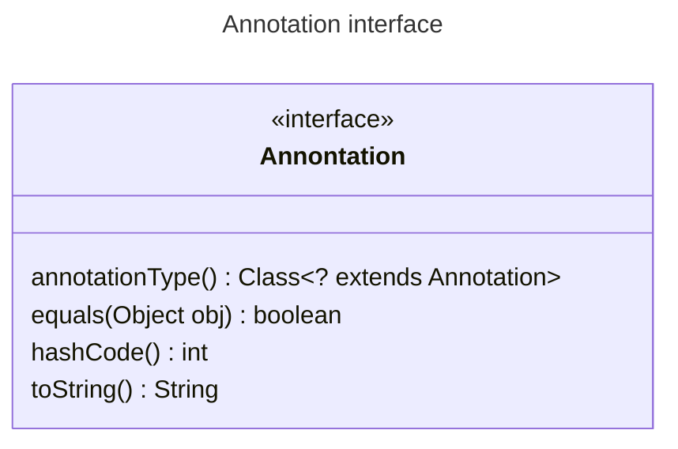

# Session 7

---

## Agenda

* Introduction
* Annotations
* Generics
* Enums
* Examples
* Proposed Problems

---

## Introduction

---

## Annotations

* Annotations enable you to associate (or annotate) metadata (or notes) to the program elements in Java program.
* The program elements: 
  * Module
  * Package
  * Class
  * Interface
  * Field of a class
  * Local Variable
  * Method
  * A parameter of a method
  * An enum
  * An annotation
  * A type parameter in a generic type/method declaration
  * A type use

> In summary, you can annotate any declaration or type used in a Java Program.

---

## Annotations (2)

To make an annotation available to the compiler and the runtime, an annotation has to follow rules.

* An annotation is another type like a class or an interface.
* As you have to declare a class or an interface type before you can use it, you must also declare an annotation type.

---

## Annotations (3) - Restrictions

1. An annotation type cannot inherit from another annotation type.(Every annotation type implicitly inherites from the `java.lang.annotation.Annotation`)

2. Methods declaration in an annotation type cannot specify any parameters.
3. Method declaration in an annotation type cannot have a `throws` clause.
4. The return type of a method declared in an annotation type must be one of the following types:
   * Any primitive type: `byte`, `short`, `int`, `long`, `float`, `double`, `boolean` and `char`
   * `java.lang.String`
   * `java.lang.Class`
   * An enum type
   * An annotation type
   * An array of any of the previously mentioned types. The return type cannot be a nested array.
5. Annotation type cannot declare a method, which would be equivalent to overriding a method in the `Object`class or the `Annotation` interface.
6. Annotation type cannot be generic.

---

## Annotations (4) - Meta-Annotation Types

* `Target` Indicates the context in which an annotation is applicable. `java.lang.annotation.ElementType`
* `Retention` Indicates how long annotations with the annotated type are to be retained. `java.lang.annotation.RetentionPolicy`
* `Inherited` Indicates that an annotation is automatically inherited.
* `Documented` if the annotation `@Documented`is presented on the declaration of an annotation type `A`, then any `@A` annotation on an element is considered part of the element's public contract. 
* `Repeatable` Indicates that the annotation type whose declaration it (meta-)annotates is *repeatable*.

---

## Annotations (5) - Commonly Used Standard Annotations

* `Deprecated`
* `Override`
* `SuppressWarnings`
* `FunctionalInterface`

---

## Generics

> Polymorphism is about writing code in terms of a type that works with many other types.

---

## Enums

---

## Examples

---

## Proposed Problems - [Beware of Dogs](https://gitlab.com/juan_cardona_epam/beware-of-dogs) 

The purpose of this exercise is to train you to work with generics.

### Description

Please, use generics to change [`House`]() class in order to dogs cannot enter cats' house and cats cannot enter dogs' house.

You need to alter `residents` field and `enter` methods of the `House` class.

Note that if you have done everything right, then two particular lines in the [`Main`]() class may prevent successful compilation, so you may need to remove them. See details in the `Main` class.

---

## Proposed Problems - [Compass](https://gitlab.com/juan_cardona_epam/compass) 

The purpose of this exercise is to train you to work with enums.

Estimated workload of this exercise is *60 min*.

### Description

Please, implement methods in [Direction]() class:

- `ofDegrees` - Return a Direction instance by input degrees or `null` if there is none.
- `closestToDegrees` - Return the closest Direction instance to input degrees.
- `opposite` - Return a Direction instance that is opposite to this.
- `differenceDegreesTo` - Return the difference in degrees between this and input Direction instance.

Note that degrees input value may be out of the [0; 360) range. Adjust them accordingly.

