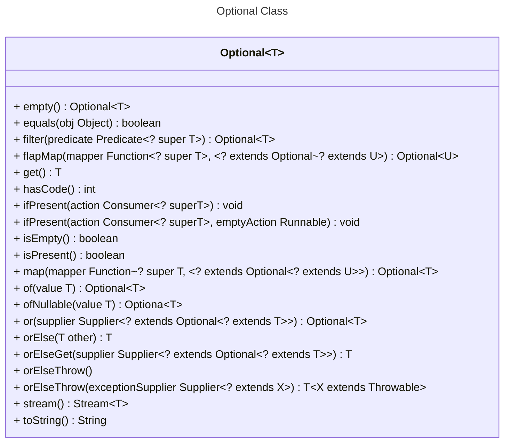

# Session 8

---

## Agenda

* Introduction
* Wrapper Classes
* Optional
* Code Documentation
* Examples 
* Proposed Problems

---

## Introduction

---

## Wrapper Classes

> **Wrapper Classes** in Java are classes that provide a way to use primitive data types as objects. Each primitive data type has a corresponding wrapper class, which encapsulates the primitive value and provides additional functionality. Here are the commonly used wrapper classes and their corresponding primitive data types:

- `Integer` (int)
- `Double` (double)
- `Character` (char)
- `Boolean` (boolean)
- `Byte` (byte)
- `Short` (short)
- `Long` (long)
- `Float` (float)

---

## Wrapper Classes (2) - Why Are Wrapper Classes Needed?

1. **Null Values:** Primitive data types cannot be `null`. In many scenarios, you need to represent the absence of a value. Wrapper classes allow you to use `null` to describe a lack of value.
2. **Generics:** Generics work with objects, not primitives. If you want to use collections, lists, or other generic data structures with primitive data types, you can use wrapper classes.
3. **Method Overloading:** In some cases, method overloading requires parameters to have different data types. Using wrapper classes, you can create overloaded methods that accept the corresponding wrapper class as a parameter.
4. **Data Structures:** Many Java libraries and data structures (e.g., `ArrayList`, `HashMap`) work with objects. Wrapper classes allow you to use primitives in these data structures.

---

## Wrapper Classes (3) - Wrapper Classes vs. Data Types

1. **Memory Overhead:** Wrapper classes consume more memory than primitive data types because they store additional information about the object. This can be a concern for performance-critical applications.
2. **Immutability:** Wrapper objects are immutable, meaning their values cannot be changed once set. In contrast, primitive data types can be modified.
3. **Auto-Boxing and Auto-Unboxing:** Java provides auto-boxing (converting primitives to their corresponding wrapper objects) and auto-unboxing (converting wrapper objects to primitives) for convenience. However, these operations can have a performance cost.

---

## Optional

* [Optional Definition Oracle](https://www.oracle.com/technical-resources/articles/java/java8-optional.html)
* Java SE 8 introduces a new class called `java.util.Optional<T>` that is inspired from the ideas of [Haskell] and Scala.

---

## Optional (2)

---

## Examples

---

## Proposed Problems

